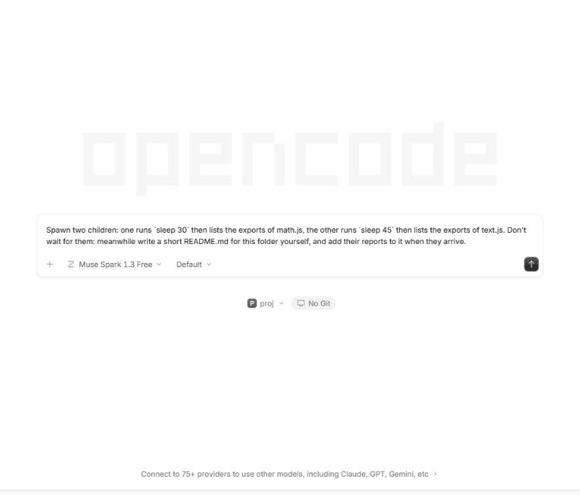
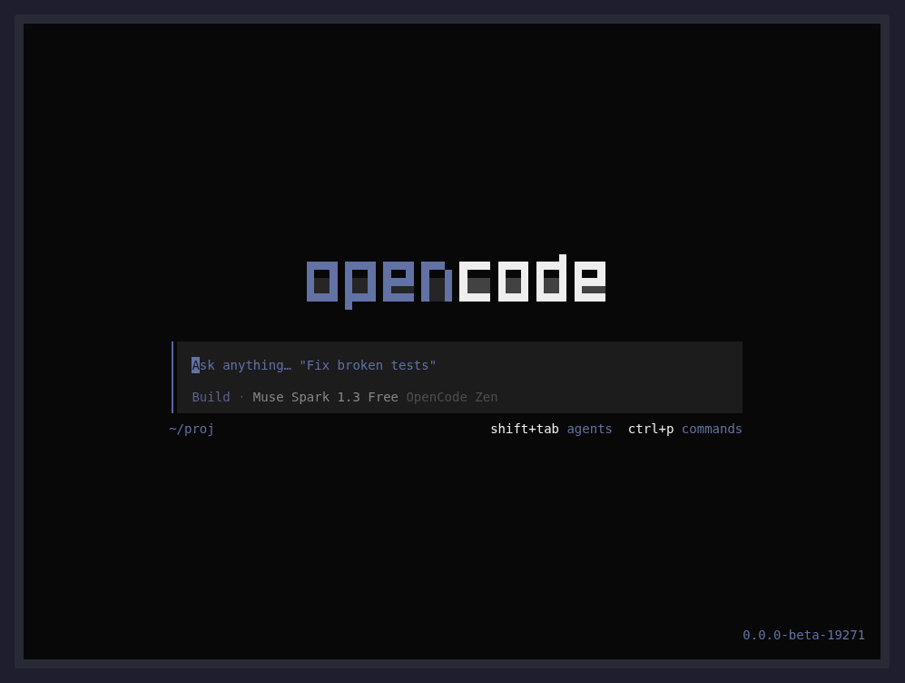
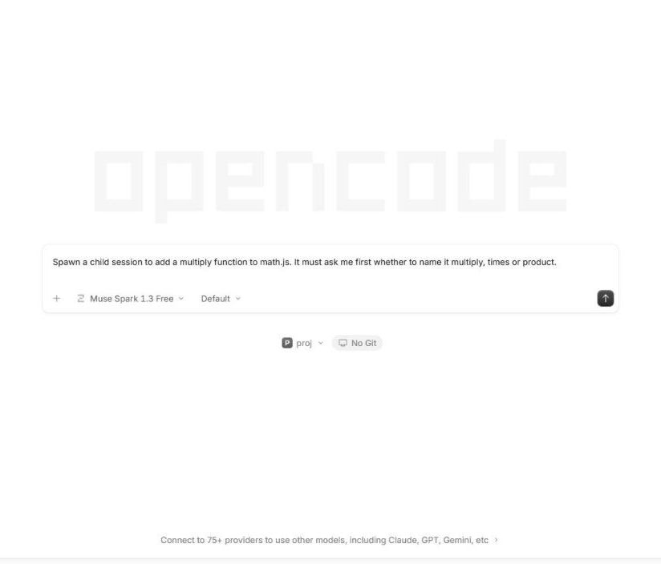
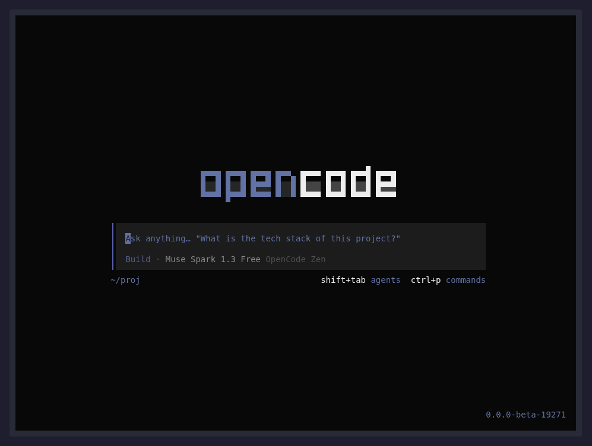

# opencode-courier

[](https://github.com/ivopogace/opencode-courier/actions/workflows/ci.yml)

An [OpenCode](https://github.com/anomalyco/opencode) V2 plugin that lets one session start other
sessions, message them, and be woken by them, without polling.

A parent session calls `courier_spawn`, gets a session id back immediately and ends its turn. The
child works on its own and, when it is done or stuck, calls `courier_send` with the parent's id.
That message lands in the parent's inbox and OpenCode starts a new turn for the parent if it is
idle. A child whose turn fails instead, so that it cannot report, is reported by the plugin, and a
child that waits for a permission or asks a question has it passed to the parent, who asks you and
passes your answer back.

The parent does not wait. Prompt: *"Spawn two children: one runs `sleep 30` then lists the exports
of math.js, the other runs `sleep 45` then lists the exports of text.js. Don't wait for them:
meanwhile write a short README.md for this folder yourself, and add their reports to it when they
arrive."*



Watch the parent write its README and finish its turn 13 seconds in, while both children still
sleep. Each report then starts a new turn on its own (the `Details` line is the child's message):
the first after about 30 seconds, the second after about 45, and the parent folds each into the
README.

The same run in the terminal UI (`opencode2` with no subcommand), where each wake shows as a new turn
in the same session:



A child's question reaches you. Prompt: *"Spawn a child session to add a multiply function to
math.js. It must ask me first whether to name it multiply, times or product."*



Watch the child's question open in the parent's session, where the answer `times` is picked. The
parent passes it back, and the child adds `times` to math.js and reports.

In the terminal UI the relayed question is the TUI's own question form, answered with the arrow keys:



> **Status: early.** Passes an end-to-end test inside a live OpenCode V2 server
> (`opencode2 v0.0.0-beta-19271`) driven by a scripted stand-in model (`e2e/run.sh`), and a smoke
> test with real (free) models: see [Real models](#real-models).

## How the wake works

There is no polling anywhere. `courier_send` calls the plugin API's `session.synthetic`, which
admits a message into the target session's inbox and, unless `resume: false` is passed, calls
`execution.wake` on it (`packages/core/src/session/session.ts` on OpenCode's `beta` branch).
OpenCode's own background subagents report to their parent the same way
(`packages/core/src/session/subagent-completion.ts`).

Delivery is `steer` by default (injected into the target's running turn, or starts one if idle);
`queue: true` waits until the current turn ends.

## Tools

| Tool | Does |
|---|---|
| `courier_spawn` | Creates a session (optionally in its own git worktree with `isolate: true`) on the parent's model, sends it the task plus a brief naming the parent and how to report back, and returns at once. |
| `courier_send` | Delivers a message to a session, signed with the sender's id, waking it if idle. |
| `courier_status` | One look at a session: outcome, idle time, last reply and the permission requests and questions it waits on. For check-ins, not for waiting. |
| `courier_children` | Lists the sessions this one (or a given `sessionID`) started with `courier_spawn`, each with what `courier_status` reports plus its directory, whether it is isolated and when it was started. |
| `courier_cleanup` | Removes the git worktree of a child started with `isolate: true` and drops the child from `courier_children`. Keeps a worktree with uncommitted changes or commits on no branch, tag or remote and lists them, unless `force: true` is passed. |
| `courier_answer` | Passes the person's answer to a permission request or a question that a session started from this one waits on, after the plugin relayed it here: `reply` (`once`, `always` or `reject`, with an optional `message`) for a permission request, `answers` for a question. See [A child that asks for permission](docs/reference.md#a-child-that-asks-for-permission) and [A child that asks a question](docs/reference.md#a-child-that-asks-a-question). |
| `courier_later` | Schedules a message for a session (this one by default) in `delayMinutes` or `at` an ISO time, and returns an id. When due it is delivered like `courier_send`, queued behind any running turn and waking the session if idle. |
| `courier_cancel` | Drops a message scheduled with `courier_later`, e.g. because the child it was waiting for reported first. |
| `courier_subscribe` | Subscribes a session (this one by default) to webhook deliveries for a `topic`: `owner/repo`, `owner/repo#12` (one pull request or issue) or a generic name. Each matching delivery arrives as a message, queued behind any running turn and waking the session if idle. Needs the [webhook receiver](#receiving-webhooks). |
| `courier_unsubscribe` | Drops one topic, or all of a session's, e.g. once its pull request is merged. |

How a child runs, what reaches its parent when it fails, asks for permission or asks a question,
what the plugin stores and for how long, and what the webhook receiver does with a delivery:
[docs/reference.md](docs/reference.md).

## Install

Requires OpenCode V2, command `opencode2`. Its plugin API is still beta, and each release is built
and tested against one version of it: the `@opencode-ai/plugin` peer dependency in `package.json`.
The CLI of that version is the one known to work:

```bash
npm install -g @opencode-ai/cli@0.0.0-beta-19271
```

Then install the plugin:

```bash
opencode2 plugin add opencode-courier
```

This installs the package from npm and adds `"opencode-courier"` to `plugins` in the global
configuration (`~/.config/opencode/opencode.json`). To receive webhooks, replace that entry with the
object form shown below, which carries a `webhook` option.

### From a local clone

```bash
git clone <this repo> && cd opencode-courier
bun install && npm run build
```

Then list it in `opencode.json` (V2 uses `plugins`, plural). A local plugin path must be a
**directory**; OpenCode loads its `index.js`, and ignores a path to a file with a warning:

```jsonc
{
  "plugins": ["/absolute/path/to/opencode-courier/dist"]
}
```

## Receiving webhooks

The receiver is off unless the plugin has a `webhook` option. Put it in the **global** config
(`~/.config/opencode/opencode.json`), since there is one receiver per OpenCode server:

```jsonc
{
  "plugins": [
    {
      "package": "opencode-courier",
      "options": { "webhook": { "port": 4097, "secretFile": "~/.config/opencode/courier-webhook-secret" } }
    }
  ]
}
```

From a local clone, `package` is the path to its `dist` directory instead. `"webhook": true`
takes every default. If the option is given more than once, for example in a project's config as
well, the first location to load wins, and the others log that their settings are ignored.

| Option | Default | |
|---|---|---|
| `port` | `4097` | Port to listen on. |
| `host` | `127.0.0.1` | Address to bind. Only this machine can reach the default. |
| `secretFile` | | File holding the shared secret (`~` is expanded). |
| `secretEnv` | `COURIER_WEBHOOK_SECRET` | Environment variable holding it, when there is no `secretFile`. |
| `maxBytes` | `1048576` | Largest body accepted. |

The secret is never read from `opencode.json` itself (a `secret` key is refused), so the config
can be committed. Make one with `openssl rand -hex 32 > ~/.config/opencode/courier-webhook-secret`
and `chmod 600` it. A file is the safer choice with `opencode2 service start`, whose environment
may not be your shell's. Without a usable secret the receiver does not start, and the server log
says why.

On GitHub, add a webhook to the repository (Settings → Webhooks) with content type
`application/json`, the same secret, and the events you want (pull request reviews, review
comments, issue comments, pull requests, check suites or workflow runs). GitHub must reach the
receiver, and by default it only listens on `127.0.0.1`: forward a public URL to it with a tunnel
you trust (`cloudflared tunnel --url http://127.0.0.1:4097`, `ngrok http 4097`, or
`smee --url https://smee.io/<channel> --target http://127.0.0.1:4097/github`, which needs no
inbound port at all) and use `<public URL>/github` as the payload URL. Whatever you expose, only
signed deliveries are acted on.

The receiver starts when OpenCode loads the plugin, which after a server start happens the first
time a project is used. Until then deliveries fail; GitHub does not retry them on its own, but
lists them under Recent Deliveries with a Redeliver button.

## Using it

1. Keep the background server running so sessions can be woken while you are away
   (`opencode2 service start`; `opencode2 service status` to check).
2. Give the agents that run children the permissions their work needs. A child that hits an
   approval prompt has it passed to its parent, which asks you (see
   [A child that asks for permission](docs/reference.md#a-child-that-asks-for-permission)), but the child waits
   until you answer, so keep prompts for what you want to decide yourself. A child's question goes
   to the parent the same way (see [A child that asks a question](docs/reference.md#a-child-that-asks-a-question)),
   so let the agents that run children use the `question` tool if they should be able to ask you;
   OpenCode's default agent may.
3. Use `isolate: true` whenever children edit files in parallel. The child's worktree is made
   from the last commit, so an uncommitted `opencode.json` is not there and the child falls back
   to your global config: keep providers and models in the global config, or commit the file.
   When you are done with an isolated child, `courier_cleanup` it so its worktree does not linger.
4. A child that crashes before calling `courier_send` never wakes the parent. When you spawn a
   long-running child, also `courier_later` a check-in for yourself, and `courier_cancel` it when
   the child reports.

## Real models

`e2e/real-model.sh` runs the same live server with a real model and asks the parent to fan a small
task out to two children. It reports which tools the parent called and in what order, whether it
ended its turn instead of polling, whether each child called `courier_send`, and whether each report
woke the idle parent. By default it uses a free model on OpenCode Zen, which needs no key:

```bash
OPENCODE_BIN=$(which opencode2) e2e/real-model.sh
COURIER_MODEL=muse-spark-1.3-contributor-free OPENCODE_BIN=$(which opencode2) e2e/real-model.sh
COURIER_SCENARIO=permission OPENCODE_BIN=$(which opencode2) e2e/real-model.sh
COURIER_SCENARIO=question OPENCODE_BIN=$(which opencode2) e2e/real-model.sh
```

With `COURIER_SCENARIO=permission` it runs the permission relay instead: one child whose command
needs an approval, and the script in the person's place. It checks that the parent asks rather
than answering by itself, answers its question with `once`, and checks that the parent passes that
on with `courier_answer` and the child runs its command and reports.

With `COURIER_SCENARIO=question` it runs the question relay: one child whose task is to find out
from the person which of three greetings to use, without being told how to ask. The script plays
the person in the parent's session. It checks that the child asks with its question tool (or
records that it sent its question with `courier_send` instead), that the parent asks the person
rather than answering by itself, with the child's options, and that the person's answer reaches the
child, which reports it.

On `opencode2 v0.0.0-beta-19271`, `longcat-2.5-preview-free`, `muse-spark-1.3-contributor-free`
and `nemotron-3-ultra-free` complete the fan-out with both reports waking the parent, after the
tool results were tuned to say plainly that the parent should end its turn. How to run it, what
each model did, what was tuned and why: [docs/real-model.md](docs/real-model.md). It costs nothing
on the free models, and it is not part of CI.

## Roadmap

Tracked as [issues](https://github.com/ivopogace/opencode-courier/issues).

## Development

```bash
bun install
bun test           # unit tests, with a fake plugin context
npm run typecheck
npm run build      # emits dist/
OPENCODE_BIN=$(which opencode2) npm run test:e2e   # live test, see below
OPENCODE_BIN=$(which opencode2) e2e/real-model.sh  # with a real model, see Real models
```

`e2e/run.sh` starts a real OpenCode V2 server in a throwaway project and home directory, with this
plugin loaded and `e2e/mock-model.mjs` as the model: an OpenAI-compatible server that replies from
a fixed script, so no API key is needed. It checks that a parent's spawn completes, that the parent
gets a new turn after its own has ended once the child reports (shared and `isolate: true`), that
`courier_status` reports and fails readably, that a child runs on the model its parent was started
with rather than the default one, that a child whose model request is refused is reported to its
idle parent, once and with the error, that a child's permission request (a project rule makes it
ask before one command) wakes its idle parent once, with what it asks for and the choices, that
`courier_status` shows it pending and `courier_answer` passes the answer back, `once` to a shared
child and `reject` to an isolated one, after which the child carries on and reports, that a request
answered in the child's own session gets the parent a message that it is settled and a later
`courier_answer` passes nothing on, that a child's question (the stand-in model calls OpenCode's
question tool) wakes its idle parent once, with the questions, which the parent asks the person in
its own session, that `courier_status` shows it pending, and that the person's answer there reaches
the child: single choice, multi-select, a typed answer (from an isolated child), and through
`courier_answer` from a parent that relabelled the options or reworded the question, which is then
told its answers were not passed on; that answering in the child's session
withdraws the parent's question, that a dismissal on either side is passed to the other, that a
question whose child's turn was interrupted, or both turns, or that was open across a server
restart, still reaches the child with the answer, as a message, and that a question of a child's
child goes to the session at the top; that a `courier_later` message wakes an idle parent
(with its delay sent as a string, as some models send it),
that a cancelled one never arrives, that a pending one is delivered after a server restart, that
`courier_children` lists the two children a parent spawned, before and after that restart, that
a recorded GitHub review delivery (`e2e/fixtures/pull_request_review.json`), signed, wakes an idle
session subscribed with `courier_subscribe`, once, while unsigned and wrongly signed ones are
refused, and that `courier_cleanup` removes an isolated child's clean worktree but keeps one with an
uncommitted file until asked with `force`. Last, it packs the package with `npm pack`, serves the
tarball from a stand-in registry (`e2e/registry.mjs`), installs it with `opencode2 plugin add
opencode-courier` and checks that its tools load from the installed copy. It takes about two
minutes and needs node, npm, bun, git, curl, jq and openssl.

CI (`.github/workflows/ci.yml`) runs both on every push to `main` and every pull request, with the
OpenCode CLI at the same version as the pinned plugin API.

### Releasing

See [docs/releasing.md](docs/releasing.md).

### Notes on the V2 plugin API

See [docs/plugin-api-notes.md](docs/plugin-api-notes.md).

## License

MIT, see [LICENSE](LICENSE).
